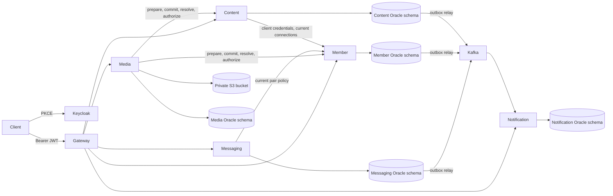
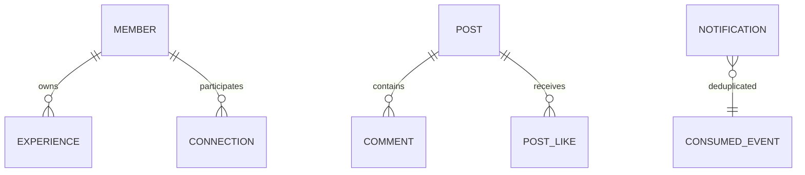

# Architecture



The Oracle instance and Kafka broker are shared local infrastructure, not high availability. Six independently packaged applications. `platform-web` holds servlet security/error/pagination mechanics, scoped HTTP client and migration utilities, never persistence entities or business repositories. Gateway uses WebFlux; business services use MVC/JPA.



Relationships use sorted member IDs with a database unique key. PENDING can become ACCEPTED by recipient, REJECTED by recipient, or CANCELLED by sender. ACCEPTED can become REMOVED by either member. A new request can reopen terminal states. A reciprocal pending request returns conflict, never implicitly accepts. Repeating a completed matching command is idempotent. Ordered participant locks serialize pair creation and degree-limit checks.

Profiles and MEMBERS posts are visible to authenticated unblocked members. CONNECTIONS posts additionally require the author or a current accepted connection. Blocking removes connections and cancels pending requests transactionally. All content paths, images and interactions check current authority; no asynchronous privacy projection. Author deletion is retained separately from moderation hiding, preventing resurrection. Existing generic notifications retain identifiers and can point to an unavailable target.

## MVP-2 privacy, media and messaging

Member remains the authoritative relationship service. Content owns visibility and moderation; media owns validated bytes and attachment lifecycle; messaging owns pair conversations and read positions. Notification payloads stay generic.

```mermaid
sequenceDiagram
 participant Client
 participant Owner as Member or Content
 participant Media
 participant S3
 Client->>Media: bounded upload with user JWT
 Media->>Media: validate and normalize bytes; durable metadata
 Media->>S3: private random object key
 Client->>Media: attach owned media IDs and operationId
 Media->>Owner: prepare durable operation intent
 Media->>Media: atomically claim owned media IDs
 Media->>Owner: commit references (only if still PREPARED)
 Media->>Media: confirm ATTACHED (retryable)
 Media->>Owner: reconcile expired claims via local operation status
 Note over Owner,Media: Status endpoint never calls media
 Client->>Media: download with user JWT
 Media->>Owner: authorize current attachment and viewer
 Owner-->>Media: allow or deny (current member policy)
 Media->>S3: stream private object only if allowed
```

```mermaid
sequenceDiagram
 participant Client
 participant Messaging
 participant Member
 participant Oracle
 participant Kafka
 Client->>Messaging: send(conversation,clientId,text)
 Messaging->>Member: current connected/unblocked policy
 Messaging->>Oracle: lock pair; dedup; sequence; message + outbox
 Oracle-->>Messaging: commit
 Messaging-->>Client: stable message result
 Messaging->>Kafka: relay generic message event after commit
```
