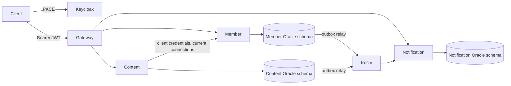
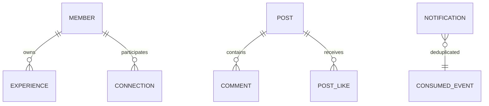

# Architecture

The Oracle instance and Kafka broker are shared local infrastructure, not high availability. Four independently packaged applications. `platform-web` holds servlet security/error/pagination mechanics only, never persistence entities or business repositories. Gateway uses WebFlux; business services use MVC/JPA.

Relationships use sorted member IDs with a database unique key. PENDING can become ACCEPTED by recipient, REJECTED by recipient, or CANCELLED by sender. ACCEPTED can become REMOVED by either member. A new request can reopen terminal states. A reciprocal pending request returns conflict, never implicitly accepts. Repeating a completed matching command is idempotent. Ordered participant locks serialize pair creation and degree-limit checks.

All profiles/posts are visible to authenticated members; accepted connections only select home-feed authors. Removing a connection affects the next feed query. No asynchronous privacy projection. Deleted posts are physically removed with child likes/comments; existing notifications retain resource IDs and may point to a 404.
